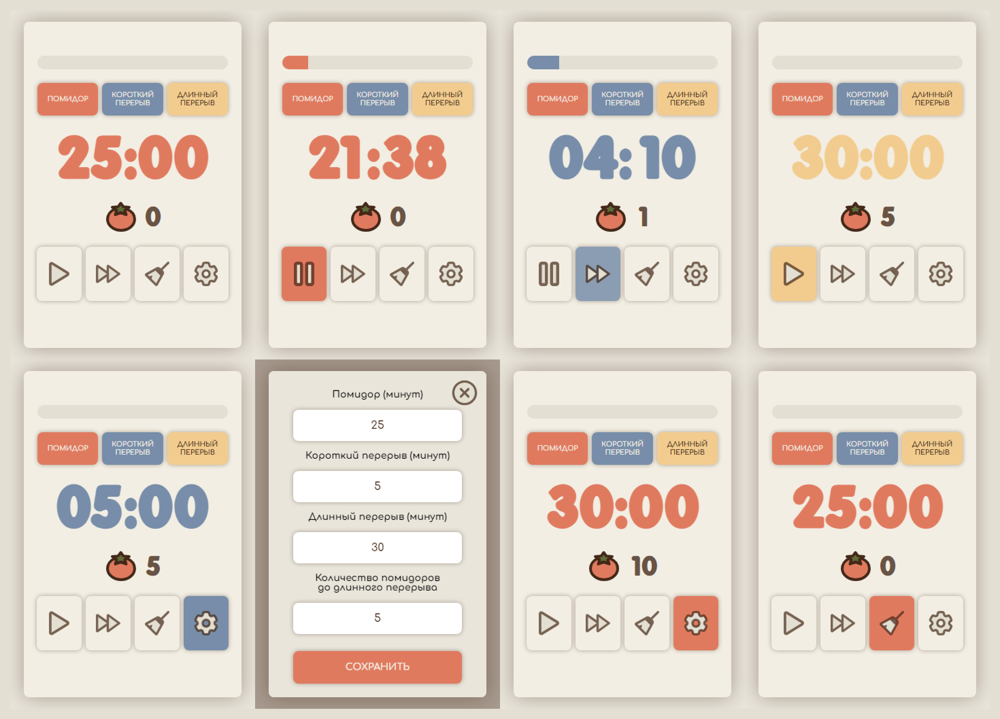

<h1> Pomodoro-таймер</h1>

[Опубликованная версия🡕](https://main--pomodoro-eslichtne.netlify.app)

## Описание 
Простое приложение, которое помогает сосредоточиться и работать / учиться продуктивно с помощью техники Pomodoro.

1. Пользователи запускают таймер и работают до тех пор, пока он не прозвенит;
2. Начинается короткий перерыв;
3. Через определённое количество помидоров (по умолчанию пять) начинается длинный перерыв.

## :pushpin: Функциональные возможности
1. **Планирование сеансов работы и перерывов**
  Пользователи могут устанавливать длительность рабочих сессий и перерывов через интерфейс настроек.
1. **Отслеживание прогресса**
  Приложение отслеживает количество завершённых сессий и сохраняет их в LocalStorage.
1. **Уведомления**
  Звуковые оповещения сообщают пользователям, когда нужно начинать перерыв или возобновлять работу.
1. **Установка приложения**
  Пользователи могут установить веб-приложение и использовать его со своего компьютера, а не внутри браузера.

## :abacus: Технологический стек
<table>
  <tr>
    <td width="70" align='center'>
      
       
      HTML
    </td>
    <td width="70" align='center'>
      
       
      CSS
    </td>
    <td width="70" align='center'>
      
       
      JavaScript
    </td>
    <td width="70" align='center'>
      
       
      БЭМ
    </td>
    <td width="70" align='center'>
      
       
      LocalStorage
    </td>
  </tr>
</table>

## :jigsaw: Архитектура
**Модульный код**
Программа разделена на небольшие функции, каждая из которых отвечает за свой функционал.

**Чистая структура**
Понятные имена функций обеспечивают читаемость кода.

**Комментарии**
Код снабжен комментариями, которые объясняют его функциональность.

## :star: Преимущества
**Адаптивный дизайн**
Веб-приложение имеет адаптивный дизайн, обеспечивающий одинаково хороший пользовательский опыт на различных устройствах.

**Прогрессивное веб-приложение (PWA)**
Приложение адаптировано для установки: имеет необходимые параметры и цветовую тему.

**Кроссбраузерность** 
Веб-приложение идентично отображается в последних версиях основных браузеров.

**Доступность** 
Семантическая вёрстка и использование aria-атрибутов способствуют повышению уровня доступности для пользователей с ограниченными возможностями.
